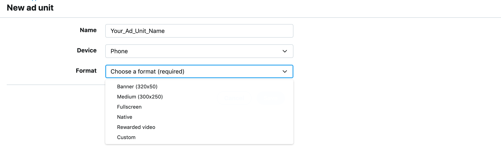
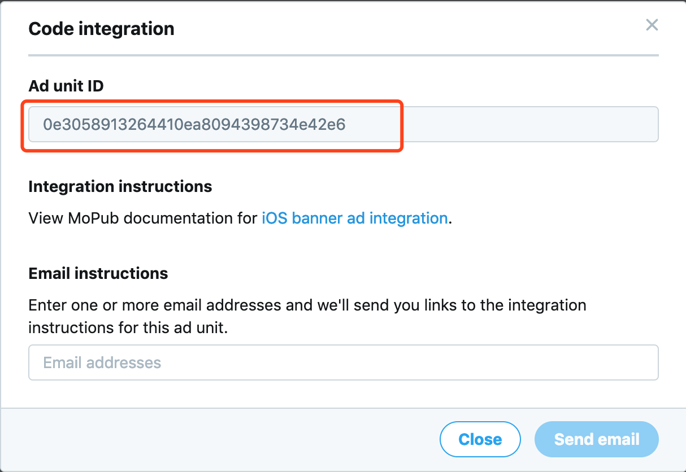
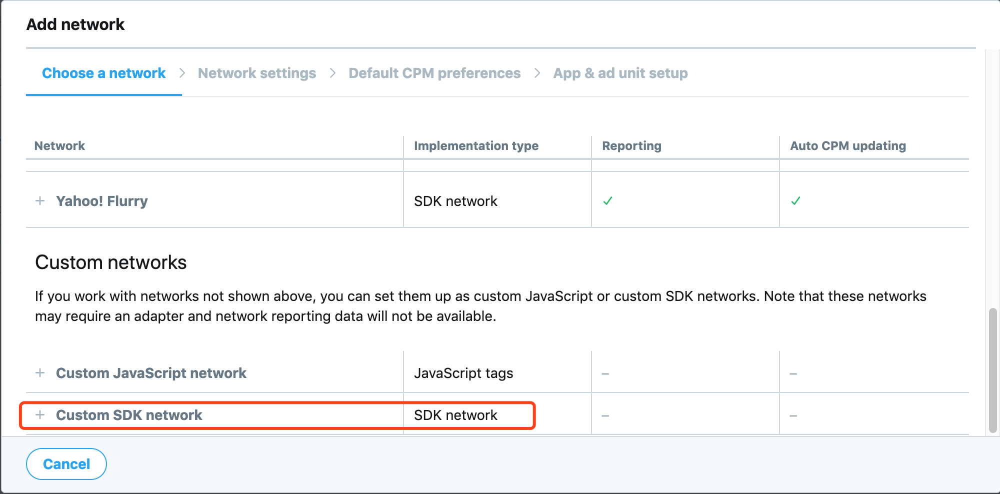
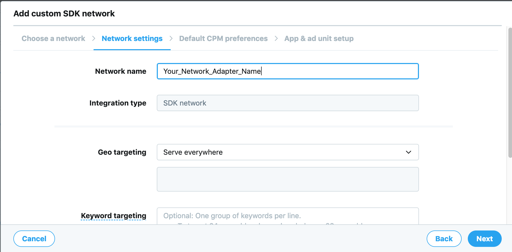
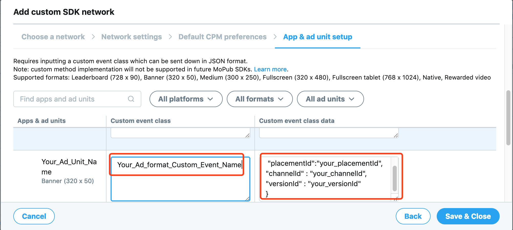
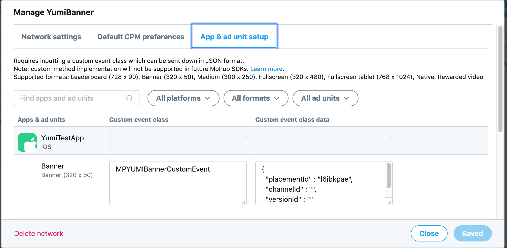
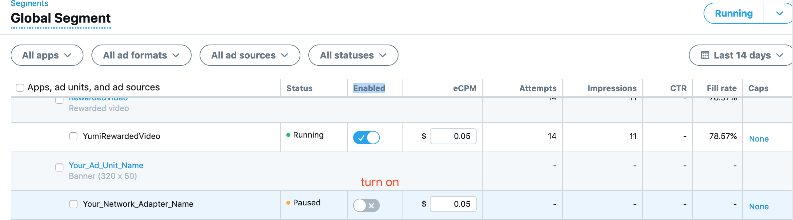

[TOC]

## 简介

* 此文档面向 Mopub 平台聚合 YumiMediationSDK  Adapter
* Mopub 广告接入请参考 [Mopub iOS SDK 接入文档](https://developers.mopub.com/publishers/ios/getting-started/)

## 1. 添加 MoPub SDK 和 YumiMediationSDK

### 1.1 使用 CocoaPods 集成

如果您对 cocoapods 不熟悉，请参阅 [Cocoapods](https://guides.cocoapods.org/using/getting-started.html)

在 Podfile 文件中添加依赖项

```objective-c
source 'https://github.com/CocoaPods/Specs.git'
platform :ios, '8.0'
use_frameworks!

target 'MyApp' do
 	pod 'mopub-ios-sdk'
    pod 'YumiMediationSDK'
end 
```

然后在终端运行以下命令：

```ruby
$ pod repo update
$ pod install
```

安装完成后，在工程根目录下打开 .xcworkspace 文件：

### 1.2 手动集成 SDK

Mopub，详见参考文档的手动集成方式  [Mopub文档](https://developers.mopub.com/publishers/ios/getting-started/#step-1-download-the-mopub-ios-sdk) 

YumiMediationSDK，详见参考文档的手动集成方式 [YumiMediationSDK文档](https://github.com/yumimobi/YumiMediationSDKDemo-iOS/blob/master/normalDocuments/YumiMediationSDK%20for%20iOS(zh-cn).md#%E6%8E%A5%E5%85%A5%E6%96%B9%E5%BC%8F)

## 2. 添加 Yumi adapter

将以下文件添加到工程里面

### 2.1. Banner adapter

[MPYUMIBannerCustomEvent.h](https://github.com/yumimobi/YumiMediationMopubAdDemo-iOS/blob/master/YumiMediationMopubAdDemo-iOS/Banner/MPYUMIBannerCustomEvent.h)

[MPYUMIBannerCustomEvent.m](https://github.com/yumimobi/YumiMediationMopubAdDemo-iOS/blob/master/YumiMediationMopubAdDemo-iOS/Banner/MPYUMIBannerCustomEvent.m)

### 2.2 Interstitial adapter

[MPYUMIInterstitialCustomEvent.h](https://github.com/yumimobi/YumiMediationMopubAdDemo-iOS/blob/master/YumiMediationMopubAdDemo-iOS/Interstitial/MPYUMIInterstitialCustomEvent.h)

[MPYUMIInterstitialCustomEvent.m](https://github.com/yumimobi/YumiMediationMopubAdDemo-iOS/blob/master/YumiMediationMopubAdDemo-iOS/Interstitial/MPYUMIInterstitialCustomEvent.m)

### 2.3 Rewarded Video adapter

[MPYUMIRewardedVideoCustomEvent.h](https://github.com/yumimobi/YumiMediationMopubAdDemo-iOS/blob/master/YumiMediationMopubAdDemo-iOS/Reward%20Video/MPYUMIRewardedVideoCustomEvent.m)

[MPYUMIRewardedVideoCustomEvent.m](https://github.com/yumimobi/YumiMediationMopubAdDemo-iOS/blob/master/YumiMediationMopubAdDemo-iOS/Reward%20Video/MPYUMIRewardedVideoCustomEvent.h)

## 3. 在 [MoPub平台](https://app.mopub.com/apps) 为 Yumi 配置广告位

### 3.1 新建 Yumi 广告位

- 进入应用，点击“New ad unit”按钮


- 创建广告位，输入广告位名称，选择您要的广告格式



- 获取新创建广告位的Ad unit ID




## 4. [MoPub平台](https://app.mopub.com/networks) 增加 Yumi Ad Networks

### 4.1 进入“Networks”页面，点击“New network”按钮，选择 ”Custom SDK network“



### 4.2 设置 Network name



### 4.3 设置 Yumi Adapter 和 Yumi 广告位信息 



在标记的地方填上您的 Adapter class name 和 您的广告位信息。

以 Banner 为例：




## 5. 在 [MoPub平台](https://app.mopub.com/segments) 打开 Yumi 广告

进入 “Segments” 页面，点击 “Global Segment” 链接，找到您创建的广告位设置为打开状态




## 6. 确认 Yumi 广告配置成功

确认步骤： **Apps->Your_App->Your_Ad_Unit_Name-> Ad source **

配置成功如下图所示：


## 7. Demo 示例

点击查看[Demo](https://github.com/yumimobi/YumiMediationMopubAdDemo-iOS)

> 注意：执行demo前，请在终端命令行进入工程根目录下执行
>
> ```ruby
> $ pod repo update
> $ pod install
> ```
