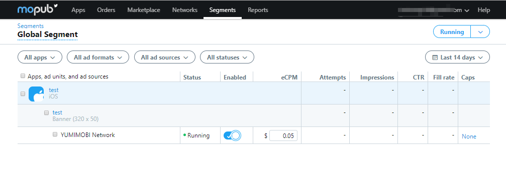

# Directory

- [Directory](#directory)
  - [1. Apply for a developer account on the YUMIMOBI platform](#1-apply-for-a-developer-account-on-the-yumimobi-platform)
    - [1.1 Enter the YUMIMOBI platform, fill in the developer basic information and submit, wait for the account to review](#11-enter-the-yumimobi-platform-fill-in-the-developer-basic-information-and-submit-wait-for-the-account-to-review)
  - [2. Apply for Ad slot（ placement） ID on YUMIMOBI platform](#2-apply-for-ad-slot-placement-id-on-yumimobi-platform)
    - [2.1 Click *Add Application* button in App Management page](#21-click-add-application-button-in-app-management-page)
    - [2.2 Fill in the relevant information and click the "Save" button to enter the Create Add Slot page.](#22-fill-in-the-relevant-information-and-click-the-%22save%22-button-to-enter-the-create-add-slot-page)
    - [2.3 After the app is created successfully, click Save or on the App Management page, click the app name to enter the Slots Page and click Add Slot, create ad Slot ( Placement ) ID](#23-after-the-app-is-created-successfully-click-save-or-on-the-app-management-page-click-the-app-name-to-enter-the-slots-page-and-click-add-slot-create-ad-slot--placement--id)
    - [2.4 Fill in the information about the add Slot （Placement）, click the "Save successfully" button, return to the ad Slots page, and get the Slot ( Placement ) ID.](#24-fill-in-the-information-about-the-add-slot-placement-click-the-%22save-successfully%22-button-return-to-the-ad-slots-page-and-get-the-slot--placement--id)
  - [3. Add MoPub SDK and YumiMediationSDK，as below：](#3-add-mopub-sdk-and-yumimediationsdkas-below)
    - [3.1 Add MoPub SDK and YumiMediationSDK](#31-add-mopub-sdk-and-yumimediationsdk)
      - [3.1.1 CocoaPods](#311-cocoapods)
      - [3.1.2 Manually Integrating SDK](#312-manually-integrating-sdk)
    - [3.2 Add YumiMediationSDK adapter](#32-add-yumimediationsdk-adapter)
      - [3.2.1 Banner adapter](#321-banner-adapter)
      - [3.2.2 Interstitial adapter](#322-interstitial-adapter)
      - [3.2.3 Rewarded Video adapter](#323-rewarded-video-adapter)
    - [3.3 Demo](#33-demo)
  - [4. Add YUMIMOBI to the new Network platform on the [MoPub platform] (https://app.mopub.com/networks)](#4-add-yumimobi-to-the-new-network-platform-on-the-mopub-platform-httpsappmopubcomnetworks)
    - [4.1 Go to the Networks page and click the 'New network' button.](#41-go-to-the-networks-page-and-click-the-new-network-button)
    - [4.2 Click the Custom networks-Custom SDK network link](#42-click-the-custom-networks-custom-sdk-network-link)
    - [4.3 Add the YUMIMOBI name to YUMIMOBI Network, follow the mopub step to enter the APP & ad unit setup page, and select the APP you want to configure.](#43-add-the-yumimobi-name-to-yumimobi-network-follow-the-mopub-step-to-enter-the-app--ad-unit-setup-page-and-select-the-app-you-want-to-configure)
    - [4.4 Select the desired configuration APP and fill in the Custom event class & Custom event class data parameter.](#44-select-the-desired-configuration-app-and-fill-in-the-custom-event-class--custom-event-class-data-parameter)
    - [4.5 Click Save to create the YUMIMOBI Network platform, Enabled status is on.](#45-click-save-to-create-the-yumimobi-network-platform-enabled-status-is-on)
  - [5. Open the YUMIMOBI ad source on the MoPub platform ](#5-open-the-yumimobi-ad-source-on-the-mopub-platform)
    - [5.1 Go to the segments page and click on the Global Segment link.](#51-go-to-the-segments-page-and-click-on-the-global-segment-link)
    - [5.2 Find YUMIMOBI apps and ad formats to ensure YUMIMOBI-Enabled status is on](#52-find-yumimobi-apps-and-ad-formats-to-ensure-yumimobi-enabled-status-is-on)
  - [6. Confirm that the YUMIMOBI configuration is successful](#6-confirm-that-the-yumimobi-configuration-is-successful)
  - [7. TEST ID](#7-test-id)

## 1. Apply for a developer account on the YUMIMOBI platform
### 1.1 Enter the [YUMIMOBI](https://ssp.yumimobi.com/#/register/) platform, fill in the developer basic information and submit, wait for the account to review


## 2. Apply for  Ad slot（ placement） ID on YUMIMOBI platform

### 2.1  Click *Add Application* button in [App Management ](https://ssp.yumimobi.com/#/app/appList/) page


### 2.2 Fill in the relevant information and click the "Save" button to enter the Create Add Slot page.

a. If your APP is launched in Google Play or APP STORE , you can fill in the app link address to get app information.


b. If you are not online on Google Play or APP STORE, or posted on a non-Google Play channel, you will need to manually fill in the app information.


### 2.3 After the app is created successfully, click Save or on the App Management page, click the app name to enter the [Slots Page](https://ssp.yumimobi.com/#/slot/slotList/0vwnp8zo/8995) and click Add Slot, create ad Slot ( Placement ) ID


### 2.4 Fill in the information about the add Slot （Placement）, click the "Save successfully" button, return to the ad Slots page, and get the Slot ( Placement ) ID.


Note: You are available to use the following ID when testing(not charge). Please switch to the ID you applied in production mode.

| Ad_Type  | Slot ( Placement ) ID |
| ---- | -------- |
|Banner  | l6ibkpae |
|Interstitial  | onkkeg5i  |
|Rewarded Video   | 5xmpgti4  |
|Native   | atb3ke1i  |
|Splash   | pwmf5r42 |


## 3. Add MoPub SDK and YumiMediationSDK，as below：

* This section aggregates for the Mopub platform YumiMediationSDK Adapter 
* Mopub of Integration Guide  [Mopub iOS SDK ](https://developers.mopub.com/publishers/ios/getting-started/)
  
### 3.1 Add MoPub SDK and YumiMediationSDK

#### 3.1.1  CocoaPods

If use CocoaPods for the first time, please view  [Cocoapods](https://guides.cocoapods.org/using/getting-started.html)

specify it in your Podfile:

```objective-c
source 'https://github.com/CocoaPods/Specs.git'
platform :ios, '8.0'
use_frameworks!

target 'MyApp' do
 	pod 'mopub-ios-sdk'
    pod 'YumiMediationSDK'
end 
```

Then, run the following command:

```ruby
$ pod repo update
$ pod install
```

After the installation is complete, open the .xcworkspace file in the project root directory:

#### 3.1.2 Manually Integrating  SDK

Mopub，Manually of Integration Guide  [Mopub Integration Guide ](https://developers.mopub.com/publishers/ios/getting-started/#step-1-download-the-mopub-ios-sdk) 

YumiMediationSDK，Manually of Integration Guide [YumiMediationSDK Integration Guide](https://github.com/yumimobi/YumiMediationSDKDemo-iOS/blob/master/normalDocuments/YumiMediationSDK%20for%20iOS(zh-cn).md#%E6%8E%A5%E5%85%A5%E6%96%B9%E5%BC%8F)

### 3.2  Add YumiMediationSDK adapter

Add the following files to the project:

#### 3.2.1 Banner adapter

[MPYUMIBannerCustomEvent.h](https://github.com/yumimobi/YumiMediationMopubAdDemo-iOS/blob/master/YumiMediationMopubAdDemo-iOS/Banner/MPYUMIBannerCustomEvent.h)

[MPYUMIBannerCustomEvent.m](https://github.com/yumimobi/YumiMediationMopubAdDemo-iOS/blob/master/YumiMediationMopubAdDemo-iOS/Banner/MPYUMIBannerCustomEvent.m)

#### 3.2.2 Interstitial adapter

[MPYUMIInterstitialCustomEvent.h](https://github.com/yumimobi/YumiMediationMopubAdDemo-iOS/blob/master/YumiMediationMopubAdDemo-iOS/Interstitial/MPYUMIInterstitialCustomEvent.h)

[MPYUMIInterstitialCustomEvent.m](https://github.com/yumimobi/YumiMediationMopubAdDemo-iOS/blob/master/YumiMediationMopubAdDemo-iOS/Interstitial/MPYUMIInterstitialCustomEvent.m)

#### 3.2.3 Rewarded Video adapter

[MPYUMIRewardedVideoCustomEvent.h](https://github.com/yumimobi/YumiMediationMopubAdDemo-iOS/blob/master/YumiMediationMopubAdDemo-iOS/Reward%20Video/MPYUMIRewardedVideoCustomEvent.h)

[MPYUMIRewardedVideoCustomEvent.m](https://github.com/yumimobi/YumiMediationMopubAdDemo-iOS/blob/master/YumiMediationMopubAdDemo-iOS/Reward%20Video/MPYUMIRewardedVideoCustomEvent.m)


### 3.3 Demo 

[GET Demo](https://github.com/yumimobi/YumiMediationMopubAdDemo-iOS)

> Note: Before executing the demo,execute the following commands in the Xcode project directory
>
> ```ruby
> $ pod repo update
> $ pod install
> ```


## 4. Add YUMIMOBI to the new Network platform on the [MoPub platform](https://app.mopub.com/networks)

### 4.1 Go to the Networks page and click the 'New network' button.


### 4.2 Click the Custom networks-Custom SDK network link


### 4.3 Add the YUMIMOBI name to YUMIMOBI Network, follow the mopub step to enter the APP & ad unit setup page, and select the APP you want to configure.


### 4.4 Select the desired configuration APP and fill in the Custom event class & Custom event class data parameter.

Example banner:

- a. Please add the following information to the location of the Custom event class::

     MPYUMIBannerCustomEvent

Note: Fill in the name of the Adpter class corresponding to the Add YumiMediationSDK adapter.

- b. Please add the slot （Placement） ID requested by YUMIMOBI advertising platform at the location of Custom event class data. The value of channel Id & version Id is not required.
  
{
 "placementId":"your_placementId",
"channelId" : "your_channelId",
"versionId" : "your_versionId"
}


### 4.5 Click Save to create the YUMIMOBI Network platform, Enabled status is on.


## 5. Open the YUMIMOBI ad source on the [MoPub platform ](https://app.mopub.com/segments)

### 5.1 Go to the segments page and click on the Global Segment link.


### 5.2 Find YUMIMOBI apps and ad formats to ensure YUMIMOBI-Enabled status is on



## 6. Confirm that the YUMIMOBI configuration is successful

Go to 5.2 and open YUMIMOB's ad slot management page. Confirm the following steps: <b>Apps->Your_App->Your_Ad_Unit_Name-> Ad source</b> , if successful, it will be in[ad sources](https: //app.mopub.com/ad-unit?key=5dbd7deb4bc34fc49e3ef1d4edb4a5b3) the following message will appear in the list. If it is not displayed, please refer to the above steps for inspection.


## 7.  TEST ID

Note: You are available to use the following ID when testing(not charge). Please switch to the ID you applied in production mode.

| Ad_Type  | Slot ( Placement ) ID |
| ---- | -------- |
|Banner  | l6ibkpae |
|Interstitial  | onkkeg5i  |
|Rewarded Video   | 5xmpgti4  |
|Native   | atb3ke1i  |
|Splash   | pwmf5r42 |

